# Taptap CLI

> A lightning-fast, secure command-line tool for deploying static web projects with built-in authentication and zero configuration hassle.

## 🚀 Overview

Taptap CLI revolutionizes the deployment experience for front-end developers, students, and teams working on static web projects. Deploy your HTML, CSS, and JavaScript applications to production-ready URLs in seconds, not minutes.

With intelligent project detection, secure user authentication, automated deployment pipelines, and custom domain naming, Taptap CLI transforms complex deployment workflows into a single command experience.

## ✨ Key Features

- **🔐 Enhanced Security** - Streamlined authentication with internal user ID management
- **🎯 Custom Project Names** - Control your deployment URLs with the `--domain` flag
- **⚡ Lightning Fast** - Deploy in seconds with optimized compression and transfer
- **🛡️ Conflict Prevention** - Smart handling of duplicate project names with clear error messages
- **📊 Improved Deployment Management** - Per-deployment isolation with selective deletion
- **🔍 Local Preview** - Test your site locally before going live
- **🌐 Instant URLs** - Get production-ready URLs immediately after deployment
- **📝 Smart File Filtering** - Automatically includes only necessary web assets
- **🗂️ Deployment History** - Complete audit trail with enhanced user quota management

## 📦 Installation

Install Taptap CLI globally via npm:

```bash
npm install -g taptap-cli
```

**System Requirements:**
- Node.js 14+ 
- npm 6+
- Internet connection for deployment

## 🔑 Authentication System

Taptap CLI features a streamlined authentication system that uses your unique user ID internally for all deployment operations, eliminating the need for registration numbers and improving security.

### First Time Setup

1. **Register a new account:**
   ```bash
   taptap --register
   ```

2. **Login to your account:**
   ```bash
   taptap --login
   ```

3. **Verify your session:**
   ```bash
   taptap --whoami
   ```

### Authentication Methods

| Method | Command | Description |
|--------|---------|-------------|
| Browser Auth | `taptap --login` | Secure browser-based authentication (recommended) |
| Auto-Open Browser | `taptap --login --open` | Opens auth page automatically |
| Direct CLI | `taptap --login --direct` | Email/password prompt in terminal |

## 🚀 Quick Start Guide

### 1. Initialize Your Project
```bash
# Create a new project with template files
taptap --init
```

### 2. Authenticate
```bash
# Register new account
taptap --register

# Login to existing account
taptap --login
```

### 3. Deploy Your Site
```bash
# Navigate to your project directory
cd my-awesome-project

# Deploy with automatic project naming
taptap --deploy

# Deploy with custom project name
taptap --deploy --domain my-portfolio
```

### 4. Manage Your Deployments
```bash
# View all your deployed sites
taptap --deploy-list

# Open your latest site
taptap --open

# Delete a specific deployment (with interactive selection)
taptap --delete
```

## 📋 Complete Command Reference

### Core Commands

| Flag | Alias | Description | Auth Required |
|------|-------|-------------|---------------|
| `--init` | `init`, `-i` | Initialize new project with template files | ❌ |
| `--deploy` | `deploy`, `-d` | Deploy current folder to live URL | ✅ |
| `--deploy --domain <name>` | `-d --domain <name>` | Deploy with custom project name | ✅ |
| `--preview` | `preview`, `-p` | Preview site locally before deploying | ❌ |
| `--open` | `open`, `-o` | Open most recent deployment in browser | ❌ |

### Deployment Management

| Flag | Alias | Description | Auth Required |
|------|-------|-------------|---------------|
| `--deploy-list` | `deploy-list`, `-dl` | Show all past deployments from server | ✅ |
| `--delete` | `delete`, `-del` | Interactive deletion of selected deployment | ✅ |
| `--logs` | `logs`, `-l` | Show local deployment logs | ❌ |

### Authentication

| Flag | Alias | Description |
|------|-------|-------------|
| `--register` | `register`, `-r` | Register new CLI user account |
| `--login` | `login` | Log in using browser-based auth |
| `--login --open` | - | Login and auto-open auth page |
| `--login --direct` | - | Direct CLI login (email/password) |
| `--logout` | `logout` | Logout current user session |
| `--logout --silent` | `logout -s` | Logout quietly without output |
| `--whoami` | `whoami`, `-w` | Display current logged-in user info |

### Utility Commands

| Flag | Alias | Description |
|------|-------|-------------|
| `--update` | `update`, `-u` | Check for CLI updates |
| `--version` | `version`, `-v` | Show current CLI version |
| `--about` | `about`, `-a` | Show CLI and author information |
| `--help` | `help` | Display help and usage instructions |

## 🎯 Enhanced Deployment Features

### Custom Domain Naming
The new `--domain` flag gives you full control over your deployment URLs:

```bash
# Deploy with custom project name
taptap --deploy --domain my-awesome-portfolio

# Resulting URL: https://taptap.dev/my-awesome-portfolio
```

### Conflict Handling
When a project name already exists, Taptap CLI provides clear guidance:

```bash
taptap --deploy --domain existing-project

# Output:
# ❌ Error 409: Conflict
# A project named 'existing-project' already exists.
# 
# Options:
# 1. Choose a different project name: taptap --deploy --domain new-name
# 2. Delete the existing project: taptap --delete
```

### Streamlined Authentication Flow
- **No Registration Numbers**: The CLI now uses your authenticated user ID internally
- **Structured Headers**: All requests include `x-user-uuid`, `x-user-email`, and `x-endpoint` headers
- **Enhanced Validation**: Robust server-side middleware enforces authentication checks
- **Quota Management**: Automatic enforcement of deployment limits per user

## 📁 File Processing Rules

### ✅ Included Files
```
📄 HTML Files       → .html, .htm
🎨 Stylesheets      → .css, .scss, .sass
⚡ JavaScript       → .js, .mjs, .ts
🖼️ Images           → .png, .jpg, .jpeg, .gif, .svg, .webp, .ico
🎥 Videos           → .mp4, .webm, .ogg, .avi
🔤 Fonts            → .woff, .woff2, .ttf, .otf, .eot
📊 Data Files       → .json, .xml
📄 Documents        → .pdf, .txt
```

### ❌ Excluded Files
```
🔒 Hidden Files     → .*, .env, .gitignore
📦 Dependencies     → node_modules/, vendor/
🗂️ Version Control  → .git/, .svn/
📝 Documentation    → .md, .markdown, README.*
🗜️ Archives         → .zip, .rar, .tar, .gz
📋 Logs             → .log, .logs
⚙️ Config Files     → package.json, webpack.config.js
```

## 🔄 Enhanced Deployment Workflow

### Automated Deployment Process

```mermaid
graph LR
    A[Project Scan] --> B[Authentication Check]
    B --> C[Domain Validation]
    C --> D[Conflict Detection]
    D --> E[File Filtering]
    E --> F[Temporary Packaging]
    F --> G[Compression]
    G --> H[Secure Upload]
    H --> I[URL Generation]
    I --> J[Cleanup]
    J --> K[Success Notification]
```



1. **🔍 Project Detection** - Enhanced validation of `index.html` presence and project structure
2. **🔐 Authentication Verification** - Streamlined user session validation with internal ID management
3. **🎯 Domain Validation** - Checks custom project names and handles conflicts
4. **⚠️ Conflict Detection** - Prevents overwrites with clear 409 Conflict responses
5. **📋 File Collection** - Gathers deployable assets using inclusion rules
6. **📦 Temporary Packaging** - Creates optimized deployment bundle with improved zipping
7. **🗜️ Compression** - Efficient zip compression for faster transfer
8. **🔒 Secure Upload** - Encrypted transfer with detailed error handling
9. **🌐 URL Assignment** - Generates unique, production-ready URL with custom naming
10. **🧹 Cleanup** - Enhanced cleanup logic removes temporary files and artifacts

## 🗂️ Improved Deletion System

### Per-Deployment Isolation
The enhanced `--delete` command now provides:

- **Interactive Selection**: Choose from a list of your deployments
- **Per-Project Deletion**: Only the selected project folder gets deleted
- **No Cross-Contamination**: Other deployments remain completely unaffected
- **User-Specific Filtering**: Only shows deployments belonging to your authenticated user

```bash
taptap --delete

# Interactive output:
# 📋 Your Deployments:
# 1. my-portfolio (deployed 2 days ago)
# 2. landing-page (deployed 1 week ago)
# 3. blog-site (deployed 3 weeks ago)
# 
# Select deployment to delete (1-3): 2
# 
# ✅ Successfully deleted 'landing-page'
```

## 🏗️ Project Structure Examples

### ✅ Valid Project Structure
```
my-portfolio/
├── index.html              ✅ Entry point (enhanced validation)
├── styles/
│   ├── main.css           ✅ Stylesheets
│   └── responsive.css     ✅ Additional CSS
├── scripts/
│   ├── app.js            ✅ JavaScript
│   └── utils.js          ✅ Utilities
├── assets/
│   ├── logo.png          ✅ Images
│   ├── hero-video.mp4    ✅ Media
│   └── fonts/
│       └── custom.woff2  ✅ Fonts
├── data/
│   └── config.json       ✅ Data files
├── README.md             ❌ Excluded
├── package.json          ❌ Excluded
└── node_modules/         ❌ Excluded
```

### ⚠️ Missing Requirements
```
broken-project/
├── main.html             ❌ No index.html (enhanced error message)
├── style.css             ✅ CSS present
└── script.js             ✅ JS present
```

## 🛡️ Enhanced Security & Privacy

### Advanced Data Protection
- **🔐 Internal ID Management** - No more external registration numbers
- **🌐 HTTPS Only** - All communications encrypted in transit
- **🚫 No Source Code Storage** - Temporary processing only with improved cleanup
- **🔒 User Isolation** - Complete separation between user accounts with enhanced validation
- **⏰ Session Management** - Automatic token expiration and renewal
- **📊 Quota Enforcement** - Server-side limits prevent abuse

### Enhanced Privacy Commitment
- Structured header authentication for better security
- Enhanced server-side middleware validation
- Improved error handling prevents information leakage
- Complete user data control and deletion rights
- Transparent data handling practices

## ⚠️ Important Notices

### Hosting Duration
- **🆓 Free Tier**: Sites automatically removed after **120 days**
- **💼 Extended Hosting**: Contact support for longer hosting periods
- **⚡ Renewal**: Simply redeploy to reset the 120-day timer

### Enhanced Best Practices
- Always test with `--preview` before deploying
- Use meaningful project names with the `--domain` flag for easy identification
- Handle 409 Conflicts promptly by choosing unique names or deleting old projects
- Regularly backup your deployment URLs
- Keep your CLI updated for latest features and security enhancements

## 🔧 Enhanced Troubleshooting

### Common Issues & Solutions

| Issue | Cause | Solution |
|-------|-------|----------|
| "No index.html found" | Missing entry point | Ensure `index.html` exists in project root (enhanced validation) |
| "409 Conflict: Project exists" | Duplicate project name | Use different `--domain` name or delete existing project |
| "Authentication required" | Not logged in | Run `taptap --login` (streamlined flow) |
| "Deployment failed" | Network/server error | Check connection, retry deployment (improved error messages) |
| "Session expired" | Token timeout | Re-authenticate with `taptap --login` |
| "Quota exceeded" | Too many deployments | Delete unused projects with `taptap --delete` |
| "Upload failed" | File/network issue | Enhanced error details provided for debugging |

### Enhanced Debug Commands
```bash
# Check authentication status (shows internal user ID status)
taptap --whoami

# View detailed logs (improved error reporting)
taptap --logs

# Test project locally (enhanced validation)
taptap --preview

# Verify CLI version (check for latest enhancements)
taptap --version
```

## 🚧 Roadmap & Future Features

### Recently Added ✅
- **🎯 Custom Domain Naming** - `--domain` flag for custom project names
- **⚠️ Smart Conflict Handling** - Clear 409 error messages with guidance
- **🔐 Streamlined Authentication** - Internal user ID management
- **🗂️ Enhanced Deletion System** - Per-deployment isolation and interactive selection
- **📊 Quota Management** - Server-side enforcement of deployment limits
- **🛡️ Structured Headers** - Enhanced security with `x-user-uuid`, `x-user-email`, `x-endpoint`

### Coming Soon
- **🎨 True Custom Domains** - Connect your own domain names (beyond project naming)
- **🔄 CI/CD Integration** - GitHub Actions and GitLab CI support
- **📊 Analytics Dashboard** - Basic site performance metrics
- **👥 Team Collaboration** - Share projects with team members
- **🎯 A/B Testing** - Deploy multiple versions for testing
- **🌍 CDN Integration** - Global content distribution
- **🔧 Build Pipeline** - Support for modern frameworks (React, Vue, Angular)

## 🆕 Latest Enhancements Summary

We have significantly enhanced the Taptap CLI with the following improvements:

### 🔐 Streamlined Security
- **Internal User ID Management**: The `--deploy` command no longer requires registration numbers, using authenticated user IDs internally for improved security and usability
- **Structured Authentication Headers**: All requests now include `x-user-uuid`, `x-user-email`, and `x-endpoint` headers for robust validation
- **Enhanced Middleware**: Server-side authentication checks have been upgraded with better error handling

### 🎯 Custom Project Control
- **Domain Flag**: New `--domain <name>` flag allows custom project naming for better URL control
- **Smart Conflict Handling**: Clear `409 Conflict` responses when project names exist, with helpful guidance on resolution
- **Enhanced Validation**: Improved `index.html` validation and project structure checking

### 🗂️ Improved Deployment Management
- **Per-Deployment Isolation**: Enhanced deletion logic ensures only selected projects are removed
- **Interactive Selection**: Users can choose from their deployment list for precise deletion
- **Quota Management**: Server-side limits prevent abuse while maintaining user flexibility
- **Better Error Handling**: Detailed error messages for upload failures and file issues

### 🔧 Technical Improvements
- **Enhanced Zipping Process**: Improved project packaging and compression
- **Robust Cleanup Logic**: Better temporary file management and cleanup procedures
- **Detailed Error Reporting**: More informative error messages throughout the deployment process
- **Production-Safe Operations**: Enhanced reliability and user-friendly experience

## 👨‍💻 About the Author

**Anurag Anand**  
Computer Science Student at LPU Punjab  
Passionate about simplifying deployment workflows for developers worldwide.

*"Making deployment accessible to everyone, from students to professionals, with enhanced security and user control."*

## 📄 License Notice

As of version 2.3.0, Taptap CLI is now licensed under the [MIT License](LICENSE).

All users must accept the MIT license terms before using the CLI. A prompt will appear on first use to record consent.

By using this software, you agree to the terms of the license, including appropriate attribution and disclaimers.


## 🤝 Support & Community

### Get Help
- **📧 Support Email**: Contact our support team for extended hosting tokens
- **🐛 Bug Reports**: Submit issues via our support channels  
- **💡 Feature Requests**: We love hearing your ideas!
- **📚 Documentation**: Comprehensive guides and tutorials

### Stay Updated
- **🔔 CLI Updates**: Use `taptap --update` to check for new versions
- **📰 Release Notes**: Stay informed about new features and improvements
- **🚀 Beta Testing**: Join our beta program for early access to features

---

**🎉 Happy Deploying with Enhanced Control!**

*Transform your static sites into live experiences with a single command, now with custom naming, better security, and improved user experience.*