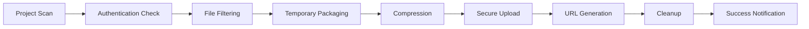

# Taptap CLI

> A lightning-fast, secure command-line tool for deploying static web projects with built-in authentication and zero configuration hassle.

## 🚀 Overview

Taptap CLI revolutionizes the deployment experience for front-end developers, students, and teams working on static web projects. Deploy your HTML, CSS, and JavaScript applications to production-ready URLs in seconds, not minutes.

With intelligent project detection, secure user authentication, and automated deployment pipelines, Taptap CLI transforms complex deployment workflows into a single command experience.

## ✨ Key Features

- **🔐 Secure Authentication** - User registration and login system for protected deployments
- **⚡ Lightning Fast** - Deploy in seconds with optimized compression and transfer
- **🎯 Zero Configuration** - Works out of the box with intelligent project detection
- **📊 Deployment Management** - Track, manage, and delete your deployed sites
- **🔍 Local Preview** - Test your site locally before going live
- **🌐 Instant URLs** - Get production-ready URLs immediately after deployment
- **📝 Smart File Filtering** - Automatically includes only necessary web assets
- **🗂️ Deployment History** - Complete audit trail of all your deployments

## 📦 Installation

Install Taptap CLI globally via npm:

```bash
npm install -g taptap-cli
```

**System Requirements:**
- Node.js 14+ 
- npm 6+
- Internet connection for deployment

## 🔑 Authentication System

Taptap CLI now requires user authentication for all deployment operations. This ensures secure access to your projects and deployment history.

### First Time Setup

1. **Register a new account:**
   ```bash
   taptap --register
   ```

2. **Login to your account:**
   ```bash
   taptap --login
   ```

3. **Verify your session:**
   ```bash
   taptap --whoami
   ```

### Authentication Methods

| Method | Command | Description |
|--------|---------|-------------|
| Browser Auth | `taptap --login` | Secure browser-based authentication (recommended) |
| Auto-Open Browser | `taptap --login --open` | Opens auth page automatically |
| Direct CLI | `taptap --login --direct` | Email/password prompt in terminal |

## 🚀 Quick Start Guide

### 1. Initialize Your Project
```bash
# Create a new project with template files
taptap --init
```

### 2. Authenticate
```bash
# Register new account
taptap --register

# Login to existing account
taptap --login
```

### 3. Deploy Your Site
```bash
# Navigate to your project directory
cd my-awesome-project

# Deploy to live URL
taptap --deploy
```

### 4. Manage Your Deployments
```bash
# View all your deployed sites
taptap --deploy-list

# Open your latest site
taptap --open

# Delete a specific deployment
taptap --delete
```

## 📋 Complete Command Reference

### Core Commands

| Flag | Alias | Description | Auth Required |
|------|-------|-------------|---------------|
| `--init` | `init`, `-i` | Initialize new project with template files | ❌ |
| `--deploy` | `deploy`, `-d` | Deploy current folder to live URL | ✅ |
| `--preview` | `preview`, `-p` | Preview site locally before deploying | ❌ |
| `--open` | `open`, `-o` | Open most recent deployment in browser | ❌ |

### Deployment Management

| Flag | Alias | Description | Auth Required |
|------|-------|-------------|---------------|
| `--deploy-list` | `deploy-list`, `-dl` | Show all past deployments from server | ✅ |
| `--delete` | `delete`, `-del` | Delete selected deployment from server | ✅ |
| `--logs` | `logs`, `-l` | Show local deployment logs | ❌ |

### Authentication

| Flag | Alias | Description |
|------|-------|-------------|
| `--register` | `register`, `-r` | Register new CLI user account |
| `--login` | `login` | Log in using browser-based auth |
| `--login --open` | - | Login and auto-open auth page |
| `--login --direct` | - | Direct CLI login (email/password) |
| `--logout` | `logout` | Logout current user session |
| `--logout --silent` | `logout -s` | Logout quietly without output |
| `--whoami` | `whoami`, `-w` | Display current logged-in user info |

### Utility Commands

| Flag | Alias | Description |
|------|-------|-------------|
| `--update` | `update`, `-u` | Check for CLI updates |
| `--version` | `version`, `-v` | Show current CLI version |
| `--about` | `about`, `-a` | Show CLI and author information |
| `--help` | `help` | Display help and usage instructions |

## 📁 File Processing Rules

### ✅ Included Files
```
📄 HTML Files       → .html, .htm
🎨 Stylesheets      → .css, .scss, .sass
⚡ JavaScript       → .js, .mjs, .ts
🖼️ Images           → .png, .jpg, .jpeg, .gif, .svg, .webp, .ico
🎥 Videos           → .mp4, .webm, .ogg, .avi
🔤 Fonts            → .woff, .woff2, .ttf, .otf, .eot
📊 Data Files       → .json, .xml
📄 Documents        → .pdf, .txt
```

### ❌ Excluded Files
```
🔒 Hidden Files     → .*, .env, .gitignore
📦 Dependencies     → node_modules/, vendor/
🗂️ Version Control  → .git/, .svn/
📝 Documentation    → .md, .markdown, README.*
🗜️ Archives         → .zip, .rar, .tar, .gz
📋 Logs             → .log, .logs
⚙️ Config Files     → package.json, webpack.config.js
```

## 🔄 Deployment Workflow

### Automated Deployment Process



1. **🔍 Project Detection** - Validates `index.html` presence and project structure
2. **🔐 Authentication Verification** - Ensures valid user session
3. **📋 File Collection** - Gathers deployable assets using inclusion rules
4. **📦 Temporary Packaging** - Creates optimized deployment bundle
5. **🗜️ Compression** - Efficient zip compression for faster transfer
6. **🔒 Secure Upload** - Encrypted transfer to deployment servers
7. **🌐 URL Assignment** - Generates unique, production-ready URL
8. **🧹 Cleanup** - Removes temporary files and artifacts

## 🏗️ Project Structure Examples

### ✅ Valid Project Structure
```
my-portfolio/
├── index.html              ✅ Entry point
├── styles/
│   ├── main.css           ✅ Stylesheets
│   └── responsive.css     ✅ Additional CSS
├── scripts/
│   ├── app.js            ✅ JavaScript
│   └── utils.js          ✅ Utilities
├── assets/
│   ├── logo.png          ✅ Images
│   ├── hero-video.mp4    ✅ Media
│   └── fonts/
│       └── custom.woff2  ✅ Fonts
├── data/
│   └── config.json       ✅ Data files
├── README.md             ❌ Excluded
├── package.json          ❌ Excluded
└── node_modules/         ❌ Excluded
```

### ⚠️ Missing Requirements
```
broken-project/
├── main.html             ❌ No index.html
├── style.css             ✅ CSS present
└── script.js             ✅ JS present
```

## 🛡️ Security & Privacy

### Data Protection
- **🔐 Encrypted Authentication** - Secure token-based auth system
- **🌐 HTTPS Only** - All communications encrypted in transit
- **🚫 No Source Code Storage** - Temporary processing only
- **🔒 User Isolation** - Complete separation between user accounts
- **⏰ Session Management** - Automatic token expiration and renewal

### Privacy Commitment
- No tracking or analytics on deployed sites
- No access to your source code post-deployment
- Complete user data control and deletion rights
- Transparent data handling practices

## ⚠️ Important Notices

### Hosting Duration
- **🆓 Free Tier**: Sites automatically removed after **120 days**
- **💼 Extended Hosting**: Contact support for longer hosting periods
- **⚡ Renewal**: Simply redeploy to reset the 120-day timer

### Best Practices
- Always test with `--preview` before deploying
- Use meaningful project names for easy identification
- Regularly backup your deployment URLs
- Keep your CLI updated for latest features and security

## 🔧 Troubleshooting

### Common Issues & Solutions

| Issue | Cause | Solution |
|-------|-------|----------|
| "No index.html found" | Missing entry point | Ensure `index.html` exists in project root |
| "Authentication required" | Not logged in | Run `taptap --login` |
| "Deployment failed" | Network/server error | Check connection, retry deployment |
| "Session expired" | Token timeout | Re-authenticate with `taptap --login` |
| "Invalid project structure" | Missing required files | Verify project contains web assets |

### Debug Commands
```bash
# Check authentication status
taptap --whoami

# View detailed logs
taptap --logs

# Test project locally
taptap --preview

# Verify CLI version
taptap --version
```

## 🚧 Roadmap & Future Features

### Coming Soon
- **🎨 Custom Domains** - Connect your own domain names
- **🔄 CI/CD Integration** - GitHub Actions and GitLab CI support
- **📊 Analytics Dashboard** - Basic site performance metrics
- **👥 Team Collaboration** - Share projects with team members
- **🎯 A/B Testing** - Deploy multiple versions for testing
- **🌍 CDN Integration** - Global content distribution
- **🔧 Build Pipeline** - Support for modern frameworks (React, Vue, Angular)

### Community Contributions
We welcome contributions for:
- **🔌 Plugin System** - Custom preprocessing workflows
- **📱 Framework Templates** - Pre-built project scaffolds
- **🛠️ Developer Tools** - Enhanced debugging and monitoring
- **🌐 Internationalization** - Multi-language support

## 👨‍💻 About the Author

**Anurag Anand**  
Computer Science Student at LPU Punjab  
Passionate about simplifying deployment workflows for developers worldwide.

*"Making deployment accessible to everyone, from students to professionals."*

## 📄 License

**ISC License** - Free to use, modify, and distribute.

## 🤝 Support & Community

### Get Help
- **📧 Support Email**: Contact our support team for extended hosting tokens
- **🐛 Bug Reports**: Submit issues via our support channels  
- **💡 Feature Requests**: We love hearing your ideas!
- **📚 Documentation**: Comprehensive guides and tutorials

### Stay Updated
- **🔔 CLI Updates**: Use `taptap --update` to check for new versions
- **📰 Release Notes**: Stay informed about new features and improvements
- **🚀 Beta Testing**: Join our beta program for early access to features

---

**🎉 Happy Deploying!**

*Transform your static sites into live experiences with a single command.*